# ImpactIQ

**Understand every change before it happens.**

ImpactIQ is an AI assistant for banks that answers one question before a change is built: *what will this change break, how risky is it, and is it safe to release?*

You give it a user story (for example "Add OTP login for mobile banking"), a sprint backlog, or a story plus a link to a GitHub repository. It tells you which systems and code the change touches, scores the risk, checks banking regulations (GDPR, PCI DSS, SOX), plans the tests and gives a clear **Go / Go with conditions / No go** call, with the reason behind every number.

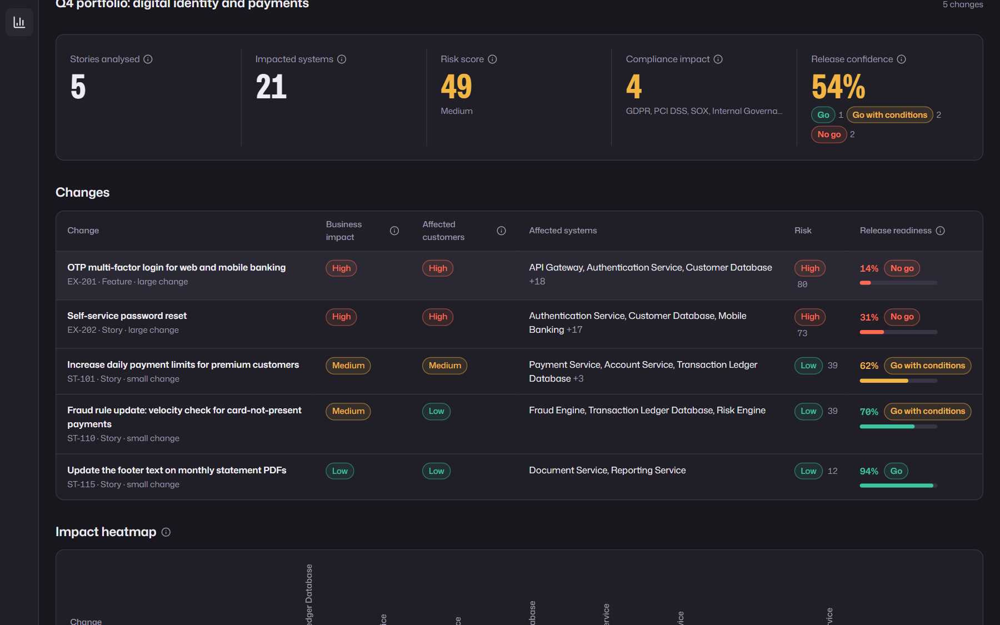

---

## Contents

- [Why it exists](#why-it-exists)
- [The two workspaces](#the-two-workspaces)
- [Executive workspace: tour](#executive-workspace-tour)
- [Engineering workspace: tour](#engineering-workspace-tour)
- [Transparency: every step and model call is visible](#transparency-every-step-and-model-call-is-visible)
- [How it works](#how-it-works)
- [Why the numbers can be trusted](#why-the-numbers-can-be-trusted)
- [Run it yourself](#run-it-yourself)
- [API](#api)
- [Project structure](#project-structure)
- [Tech stack](#tech-stack)
- [Limitations and next steps](#limitations-and-next-steps)

---

## Why it exists

In a bank, a small-looking change can reach a lot of systems. Raising a payment limit touches the payment service, the ledger database and the fraud engine. Adding OTP login touches authentication, notifications, customer data and both banking apps.

Today, working that out is manual. Developers, testers, business analysts and release managers spend days reading code and diagrams, asking around and filling in risk forms, and they repeat it for every story in every sprint. Clashes between two stories that change the same system are often found only at release time.

ImpactIQ does that analysis in minutes and shows its working, so a release manager and an engineer can look at the same change and agree on the decision.

---

## The two workspaces

The app opens with a choice of workspace. No account is needed.

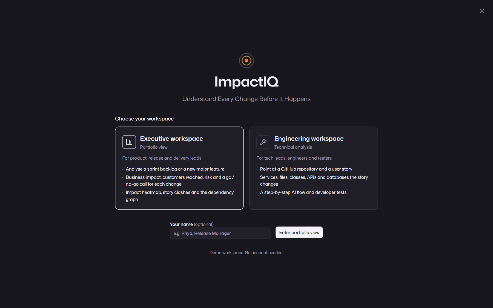

| | Executive workspace | Engineering workspace |
|---|---|---|
| **For** | Product, release and delivery leads | Tech leads, engineers and testers |
| **Input** | A sprint backlog or one major feature | A GitHub repository URL and a user story |
| **Answers** | Business impact, risk, compliance, Go / No go, clashes between stories | Which services, files, classes, APIs and database tables change, and which tests to write |

---

## Executive workspace: tour

### 1. The portfolio at a glance

Five headline numbers for the whole backlog, then one row per change, all in business language.


- **Stories analysed** and **impacted systems**: how big the sprint is and how much of the bank it reaches (here 5 stories reach 21 systems).
- **Risk score**: 0 to 100, from six risk areas (security, compliance, technical, operational, performance, delivery).
- **Compliance impact**: which regulations apply (here GDPR, PCI DSS, SOX and internal governance).
- **Release confidence**: how ready the sprint is to ship, with how many changes are Go, Go with conditions or No go.
- **One row per change**: business impact, affected customers, affected systems, risk and release readiness. For example, *OTP multi-factor login* is a large change with 14% readiness and a **No go**, while *updating a PDF footer* is small, low risk and a **Go** at 94%.

### 2. Impact heatmap and conflict engine

The **heatmap** shows every change against the systems it hits, coloured by how hard (outlined cells are systems the story changes directly).

The **conflict engine** compares every pair of stories and flags the ones that change the same systems. Here, *OTP login* and *self-service password reset* both change the authentication service, the customer database, notifications and both banking apps: a **99% conflict**, so the advice is to plan, build and test them as one change. A milder 40% clash between two payment stories gets "ship ST-110 first, then ST-101".

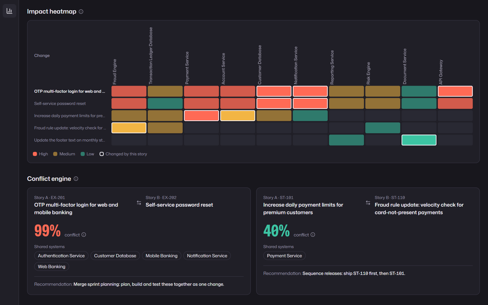

### 3. Dependency graph and AI reasoning timeline

Click any change to see its **dependency graph**: the changed components on the left, then each column one step further away, coloured by impact. Below it, the **AI reasoning timeline** shows each step in order, and whether the AI or a rule did it.

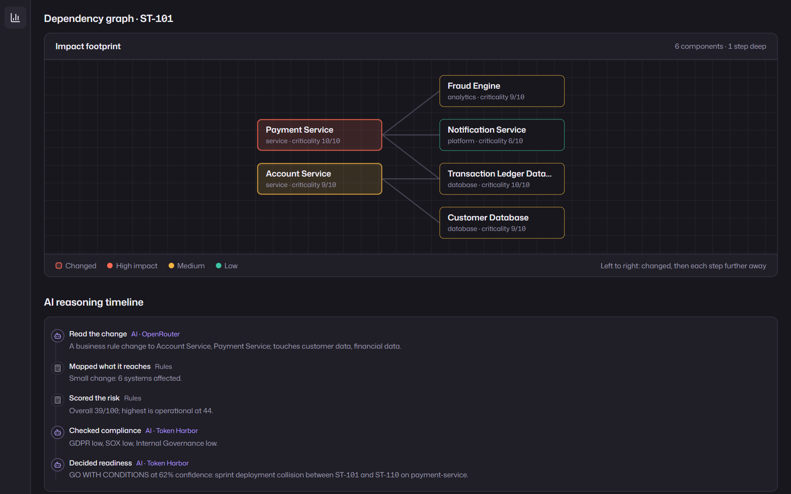

Notice the scope: raising a payment limit is classified as a **small change**, so the graph stays one step deep (6 components) instead of lighting up the whole bank.

### 4. One major feature on its own

Switch to **New major feature** to analyse a single epic in the same layout. OTP login on its own reaches 21 systems, scores high risk (80) and is **No go at 30%**, because its security risk is above the release threshold.

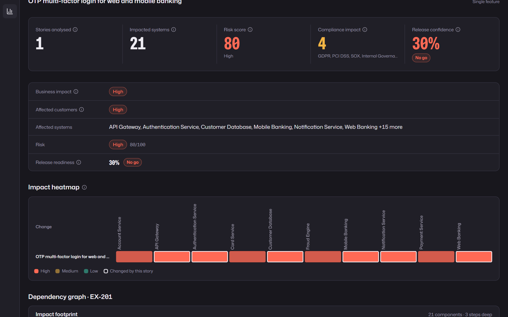

---

## Engineering workspace: tour

### 1. From a user story to the exact code

Paste a public GitHub repository URL (a whole repo or one folder) and a user story. ImpactIQ downloads the code, indexes it, and walks through an **AI flow**: user story → services → files → classes, APIs and database tables → developer tests. Each step shows whether the AI or a rule produced it.

On the left, the **codebase explorer** shows the repository tree with the files to change marked. On the right, the **architecture impact** panel shows, for each service, the classes, API routes and database tables affected.

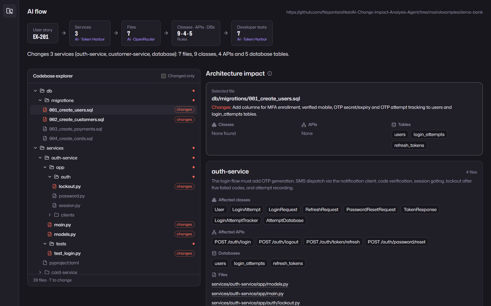

In this example (OTP login on the [demo bank](examples/demo-bank) in this repo), ImpactIQ finds 3 services, 7 files, 9 classes, 4 APIs and 5 database tables to change, out of 39 files.

### 2. A developer test plan

Five to seven concrete tests, each with a category (functional, API, unit, integration, security, regression), the exact class or endpoint it targets, and steps with an expected result.

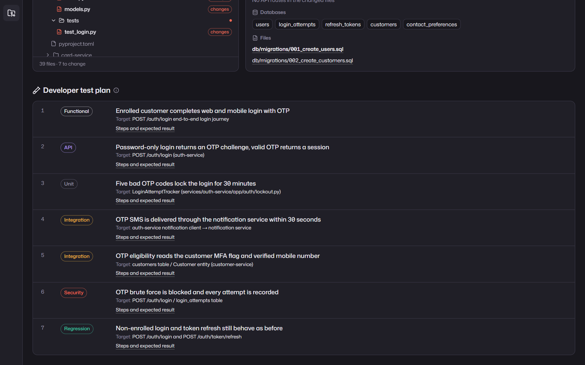

### 3. Your own story

Any story works, not only the example. Here a new story, *let customers freeze a card from the mobile app*, maps to the card, payment and auth services, down to `CardController` and `POST /cards/{cardId}/freeze`.

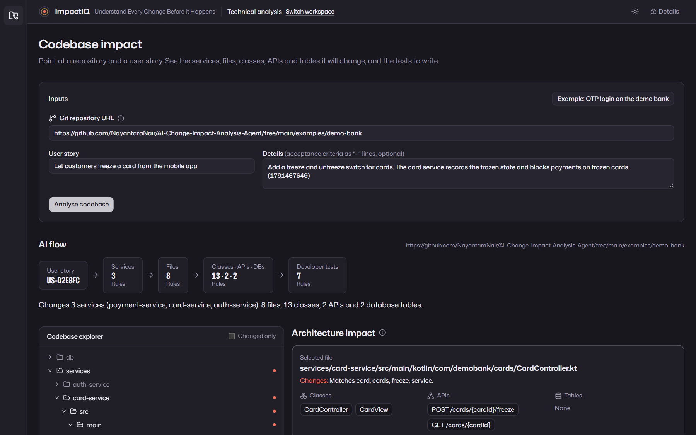

The repository is only read, never run. Classes, routes and tables are found by code (Python, Java, Kotlin, TypeScript/JavaScript, Go, C#, SQL and more). The AI can only choose from services, files and classes that really exist; anything it invents is dropped.

---

## Transparency: every step and model call is visible

Every analysis runs as a tracked job. While it runs, the page shows each step as it happens and which AI model is working on it. The **Details** pane shows the full run: every model call, how long it took, and every fallback with its reason.

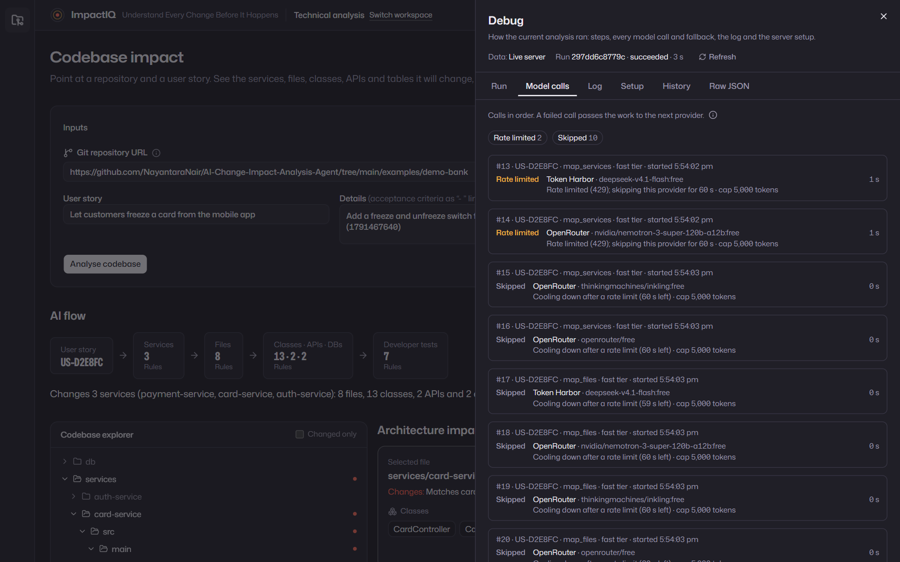

In this run the free AI providers were rate limited, so ImpactIQ moved down its provider chain and finished with its built-in rules, and says so. The app never stalls or invents a result when a model is unavailable.

Both workspaces also have a light theme:

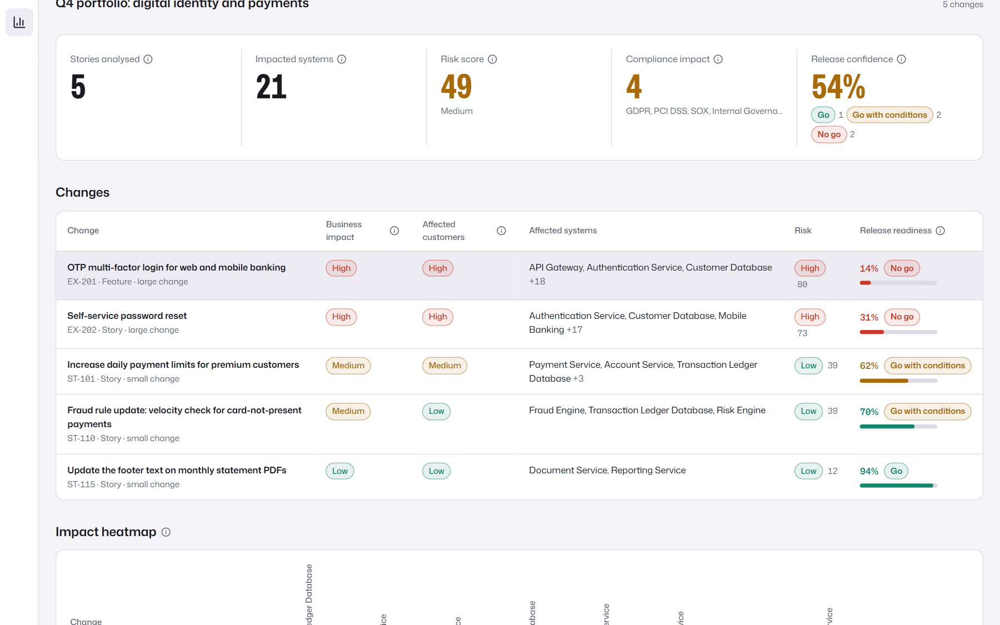

---

## How it works

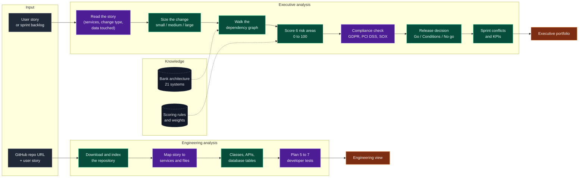

<sub>Purple steps use an AI model. Green steps are plain code (rules). Every AI step has a rule-based fallback.</sub>

**AI provider chain.** Each AI step tries the providers in order and moves on if one times out, is rate limited, cuts off its answer or returns invalid data:

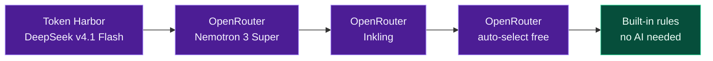

---

## Why the numbers can be trusted

**The AI reads; code decides.** The AI never produces a score or a Go / No go. It only extracts facts from the story (which systems, what kind of change, does it touch card data or the login flow) and writes the human-readable text. Every number is then computed by plain Python from those facts, the bank's architecture map ([`data/architecture.json`](data/architecture.json)) and a reviewable weights file ([`scoring_config.yaml`](backend/app/scoring_config.yaml)).

So the same story always gets the same score, and every point can be traced. For example, the security risk for a card-freeze story with step-up login:

| Reason | Points |
|---|---:|
| Baseline | 8 |
| Touches card data | +25 |
| Changes the login flow | +25 |
| Changes a public API | +15 |
| On the critical identity path | +10 |
| Reaches many components | +10 |
| **Security risk** | **93** |

The release decision then applies clear rules, such as "No go if any risk area is 85 or above", and lists which rule fired. In banking, that matters: weights can be reviewed and tuned like any other control, which you cannot do with a number an AI made up.

---

## Run it yourself

### With Docker (recommended)

You need [Docker](https://www.docker.com/products/docker-desktop/) and Git.

```bash
git clone https://github.com/NayantaraNair/AI-Change-Impact-Analysis-Agent.git
cd AI-Change-Impact-Analysis-Agent
docker compose up --build
```

When it is up, open port **3000** of the machine in your browser for the app. The backend API runs on port **8000**.

**No API keys are needed.** The demo portfolio, the demo sprint and the codebase example open from saved results, and new stories use the built-in rules.

### Optional: live AI

To have the AI read your own stories, create a `.env` file from the template and add one or both free keys:

```bash
cp .env.example .env
```

| Variable | Where to get it |
|---|---|
| `TOKENHARBOR_API_KEY` | Token Harbor |
| `OPENROUTER_API_KEY` | [openrouter.ai](https://openrouter.ai) |

Then run `docker compose up --build` again. Keys stay on your machine and are never logged.

### Without Docker

Requires Python 3.12 with [uv](https://docs.astral.sh/uv/) and Node.js 20+. In two terminals:

```bash
cd backend && uv sync && uv run uvicorn app.api.main:app --port 8000
```

```bash
cd frontend && npm install && npm run dev
```

### Tests

```bash
cd backend && uv run pytest -q
```

```bash
cd frontend && npm run lint && npm run build
```

The backend has 480+ tests and none of them call a real AI model. GitHub Actions runs both checks on every pull request.

---

## API

The backend is a FastAPI service with interactive Swagger documentation at **`/docs`** on the backend (port 8000). Every request and response shape is defined once in [`backend/app/contracts.py`](backend/app/contracts.py).

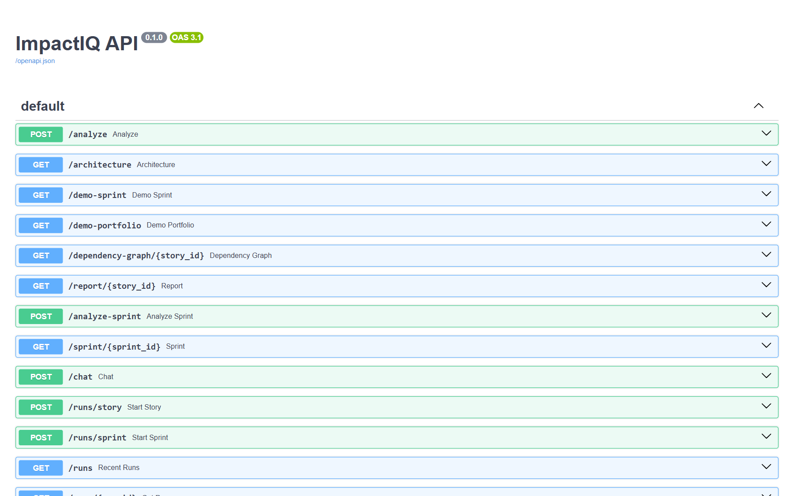

| Method | Path | What it does |
|---|---|---|
| GET | `/health` | Health check and which AI providers are configured |
| POST | `/analyze` | Analyse one story |
| POST | `/analyze-sprint` | Analyse a sprint of stories, with conflicts |
| POST | `/codebase/analyze` | Map a story onto a GitHub repository |
| POST | `/runs/story`, `/runs/sprint`, `/runs/codebase` | Start an analysis in the background and get a run ID |
| GET | `/runs/{run_id}` | Live progress of a run: steps, model calls, then the result |
| GET | `/runs` | Recent runs |
| GET | `/report/{story_id}` | Last saved analysis of a story |
| GET | `/sprint/{sprint_id}` | Last saved analysis of a sprint |
| GET | `/dependency-graph/{story_id}` | Dependency graph of a story |
| GET | `/architecture` | The bank's system catalog |
| GET | `/demo-portfolio`, `/demo-sprint`, `/demo-codebase` | The built-in examples |
| GET | `/debug` | AI provider chain, time limits and token limits (never keys) |
| POST | `/chat` | Ask questions about an analysis (API only) |

---

## Project structure

```
backend/app/
  agents/        AI steps: read the story, compliance, tests, release text (each with a rule fallback)
  engine/        Rules: change size, dependency graph, risk scores, conflicts (no AI)
  codebase/      GitHub download, code indexer, story-to-code mapping
  llm.py         AI provider chain with fallbacks
  runs.py        Live progress tracking
  api/           FastAPI routes
data/
  architecture.json   The demo bank: 21 systems and how they connect
  test_catalog.json   60 existing tests
  fixtures/           Saved results so the app works without keys
frontend/
  app/executive       Executive workspace
  app/engineering     Engineering workspace
  components/         Graph, heatmap, conflicts, code tree, details pane
examples/demo-bank/   A small bank codebase (5 services) for the engineering demo
docs/screenshots/     The images in this README
```

---

## Tech stack

| Layer | Tools |
|---|---|
| Backend | Python 3.12, FastAPI, Pydantic v2, NetworkX, SQLite (SQLModel) |
| AI | OpenAI-compatible SDK with Token Harbor and OpenRouter free models, plus rule fallbacks |
| Frontend | Next.js 16, React 19, TypeScript, Tailwind CSS v4, shadcn/ui, React Flow |
| Delivery | Docker Compose, GitHub Actions |

---

## Limitations and next steps

- The bank architecture and test catalog are hand-written for a demo bank. **Next:** build them from a CMDB, OpenAPI specs and service dependencies.
- Stories are pasted in. **Next:** connect to Jira and analyse a ticket when it is created or changed.
- Risk weights are set by hand. **Next:** tune them from past incidents and failed changes.
- Free AI models are slow and often rate limited, so a live run can take a minute or two. The built-in rules keep the app working when they are not available.
