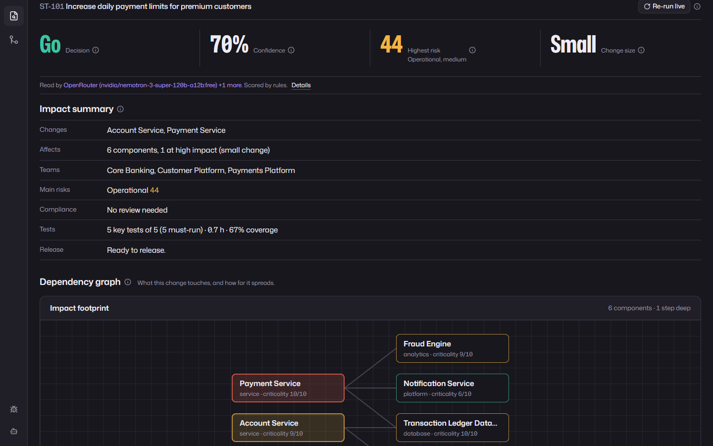
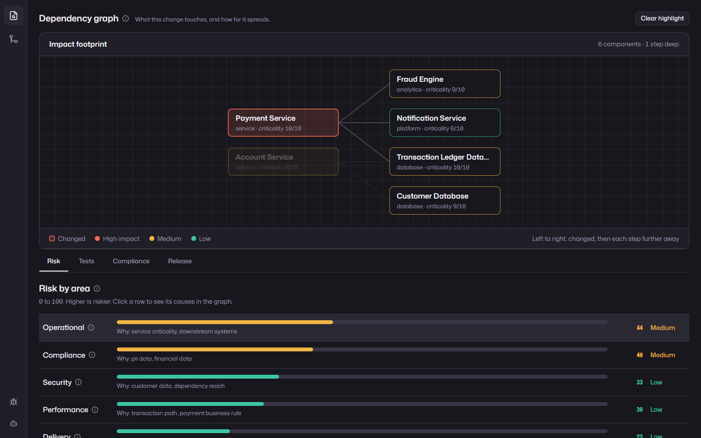
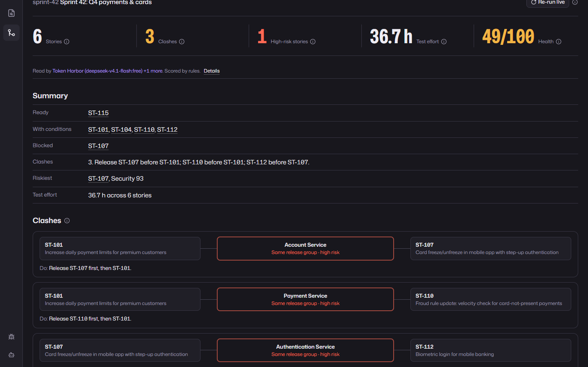
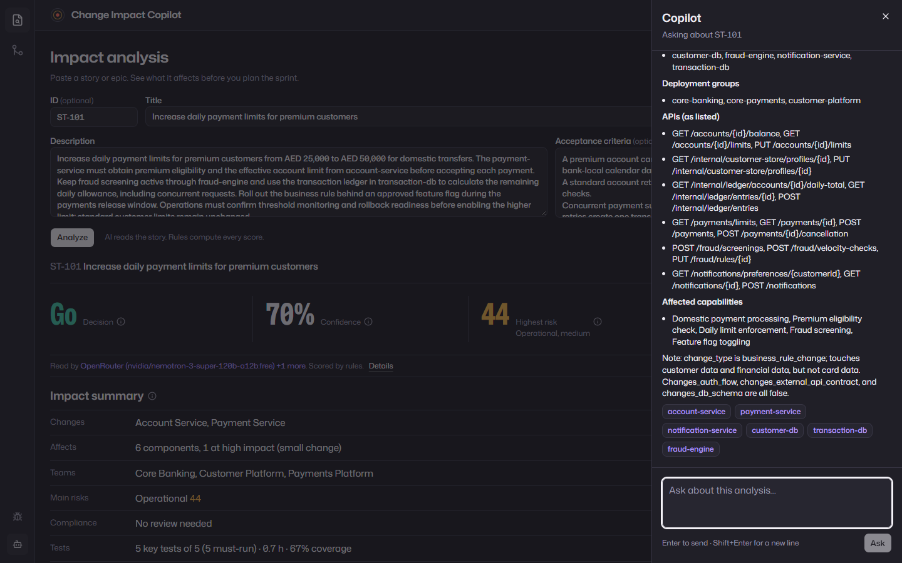
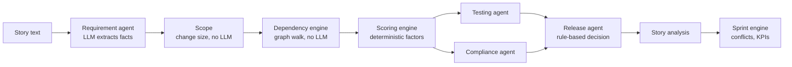

# Change Impact Copilot

Paste a story or epic, or attach a sprint backlog. See what it affects, how risky it is and whether it can ship, before you plan the sprint.



## The problem

When a change request lands, developers, leads, testers and business analysts spend days working out what it touches downstream, which regulations apply and whether it is safe to release. That analysis is repeated for every story and every sprint, and it lives in people's heads. Change Impact Copilot automates it for a banking estate: the goal is to turn days of impact analysis into minutes, with every number explained.

## What it does

Paste a Jira-style story or epic, or attach a sprint backlog (JSON, CSV, Markdown or text), and get a short impact summary first, then the detail:

- **Requirement analysis**: business and technical summary, domain, affected capabilities and services.
- **Change size and a practical scope**: code classifies each change as small, medium or large. A limit, rule, text or config change in one or two services is small: impact spreads one step, only to what it calls, and shared platform services (login, gateway, audit) count only when the change touches them. Small changes also earn a named "small, contained change" credit and run fewer tests.
- **Dependency graph**: a simple left-to-right map. Changed components on the left, each column one step further away, coloured by impact.
- **Risk in six dimensions** (security, compliance, technical, operational, performance, delivery), each 0–100 with the factors that produced it.
- **Test plan**: the top 5 tests to run first, from existing catalog tests plus new tests for gaps, prioritised P1–P3. The number of tests scales with change size.
- **Compliance**: GDPR, PCI DSS, SOX and internal governance, each with findings, a score and recommendations.
- **Release decision**: GO / GO_WITH_CONDITIONS / NO_GO with the rules that fired, a confidence score, and rollback and deployment plans of at most three steps each.
- **Sprint simulator**: all stories analysed in parallel, with conflict detection (two stories changing the same service, database, API or deployment group) and a sprint health score.
- **Copilot**: a side drawer that answers questions about the current analysis and cites the components it talks about.
- **Live progress and a debug pane**: every analysis runs as a tracked job. The page shows each step as it happens, which model is working on it and for how long, and every fallback with its reason (timed out, rate limited, cut off at the token limit). A slide-over debug pane on both pages shows the full run, every model call with token counts, the log, the provider chain and limits, and the raw JSON. Tooltips explain how each number is worked out. Light and dark modes.

| Risk factors drive the graph | Sprint conflicts | Copilot |
|---|---|---|
|  |  |  |

## How it works



Testing and compliance run in parallel, and the stories in a sprint run in parallel. Each LLM stage is cached by a hash of its input, so re-running an unchanged story is instant.

## The LLM reads; code scores

The core design decision: **the LLM never produces a score or a decision.** It reads the story and extracts categorical facts — which services from a fixed catalog, the change type, and yes/no flags such as "touches card data" or "changes the authentication flow". Everything numeric is computed in Python from those facts plus the architecture map (`data/architecture.json`), using weights in [`scoring_config.yaml`](backend/app/scoring_config.yaml). The LLM comes back at the end only to write prose: summaries, generated test cases, compliance findings, rollback plans and copilot answers.

Every point in a score is a named factor tied to the components that caused it. Security risk for ST-107 (card freeze/unfreeze with step-up authentication):

| Factor | Points | Components |
|---|---:|---|
| baseline | 8 | |
| card data | +25 | atm, card-service, fraud-engine |
| auth flow change | +25 | api-gateway, authentication-service, card-service, mobile-banking |
| external API contract | +15 | api-gateway, authentication-service, card-service, mobile-banking |
| critical identity path | +10 | api-gateway, authentication-service |
| dependency reach | +10 | components within two steps |
| **Security risk** | **93** | |

The release agent then applies ordered rules (`NO_GO` if any dimension ≥ 85; `NO_GO` if a framework is high risk and the change touches card data or authentication; …) and records each rule that fired. ST-107 is a large change (login flow and a public API both change), so it comes out `NO_GO` with 39% confidence, and the UI shows exactly why. Scope follows the change: ST-101, a payment-limit change in two services, is small. It reaches 6 components one step away, runs 5 tests and comes out `GO` at 70%.

Why it matters in banking: the same story always gets the same score, every score can be traced to a factor and a component, and the weights can be reviewed and tuned like any other control — something you cannot say about a number an LLM made up.

## Quick start

```bash
cp .env.example .env        # keys are optional
docker compose up --build
```

Open http://localhost:3000. **No API keys are needed**: the six demo stories and the demo sprint are served from saved results (`data/fixtures/`, built with the live LLM chain), and new stories fall back to deterministic keyword extraction and template prose.

To run the live pipeline on your own stories, add one or both keys to `.env`:

| Order | Provider | Model |
|---|---|---|
| 1 | Token Harbor | `deepseek-v4.1-flash:free` |
| 2 | OpenRouter | `nvidia/nemotron-3-super-120b-a12b:free` |
| 3 | OpenRouter | `thinkingmachines/inkling:free` (tool calling) |
| 4 | OpenRouter | `openrouter/free` |
| 5 | none | deterministic fallback |

A provider is skipped on 401/402/403/429, 5xx, a timeout (180 s per call, since free reasoning models are slow), an answer cut off at its token cap, invalid JSON or schema validation failure; one that rate-limits is cooled down for 60 s. The debug pane shows each of these as it happens. `cd backend && uv run python ../scripts/llm_smoke.py` reports which providers answer (it never prints keys). Unchanged demo stories keep serving their saved results; edit any field (or call `POST /analyze?refresh=true`) to analyse them live.

The frontend calls the backend through a same-origin `/api` proxy, so the app also works when opened from another machine (for example over Tailscale: `tailscale serve --bg 3000`).

## Manual development setup

Requires Python 3.12 via [uv](https://docs.astral.sh/uv/) and Node 20+.

```bash
cd backend && uv sync && uv run uvicorn app.api.main:app --reload --port 8000
cd frontend && npm install && npm run dev        # http://localhost:3000
```

Checks:

```bash
cd backend && uv run pytest -q                    # 462 tests, no network
cd backend && uv run python ../scripts/validate_data.py
cd frontend && npm run lint && npm run build
```

Regenerate the demo fixtures after changing scoring or data: `cd backend && uv run python ../scripts/build_fixtures.py --refresh`.

## API

| Method | Path | Returns |
|---|---|---|
| GET | `/health` | status, which providers are configured, whether the LLM is disabled |
| POST | `/analyze` | `StoryAnalysis` for a `StoryInput` (`?refresh=true` bypasses cache and fixtures) |
| POST | `/analyze-sprint` | `SprintAnalysis`; with no stories it runs the demo sprint |
| GET | `/demo-sprint` | the six demo stories |
| GET | `/sprint/{sprint_id}` | latest saved sprint analysis |
| GET | `/report/{story_id}` | latest saved story analysis |
| GET | `/dependency-graph/{story_id}` | latest `ImpactGraph` for a story |
| GET | `/architecture` | the component catalog |
| POST | `/chat` | copilot answer with cited components and factors |
| POST | `/runs/story`, `/runs/sprint` | start an analysis in the background and return a run ID |
| GET | `/runs/{run_id}` | live progress: stages, every model call and fallback, the log, then the result |
| GET | `/runs` | recent runs (kept in memory) |
| GET | `/debug` | provider chain, timeouts, token caps and cooldowns (never keys) |

Interactive docs at http://localhost:8000/docs. All request and response shapes are defined once in [`backend/app/contracts.py`](backend/app/contracts.py) and mirrored in [`frontend/lib/types.ts`](frontend/lib/types.ts).

## Repository layout

```
backend/app/
  contracts.py          shared Pydantic models
  llm.py                provider fallback chain
  agents/               requirement, testing, compliance, release, chat (LLM + fallback)
  engine/               dependency graph, scoring, sprint, conflicts (no LLM)
  pipeline.py           stage orchestration and caching
  runs.py               live run tracking: stages, model calls, log
  api/                  FastAPI routes
data/
  architecture.json     21 components: channels, core, platform, databases, analytics
  test_catalog.json     60 existing tests
  demo_sprint.json      six demo stories
  fixtures/             saved results for keyless mode
frontend/
  app/story, app/sprint pages
  components/graph      dependency graph (React Flow)
  components/analysis   story tabs, stat strip, factor bars
  components/copilot    copilot drawer
  components/run        live progress and provenance
  components/debug      debug slide-over
scripts/                data validation, LLM smoke test, fixture builder
```

## Tech stack

Python 3.12, FastAPI, Pydantic v2, NetworkX, SQLite (SQLModel), the OpenAI SDK against OpenAI-compatible providers · Next.js 16, React 19, TypeScript, Tailwind CSS v4, shadcn/ui, React Flow, Recharts · Docker Compose.

## Limitations and roadmap

- The architecture map and test catalog are hand-written for a demo bank. Next: build them automatically from a CMDB, OpenAPI specs and repository dependency graphs.
- Stories are pasted in. Next: Jira integration, analysing a ticket when it is created or changed.
- Scoring weights are set by hand. Next: learn them from incident and change-failure history.
- Free-tier LLMs are slow and rate-limited; a live sprint takes a few minutes.
